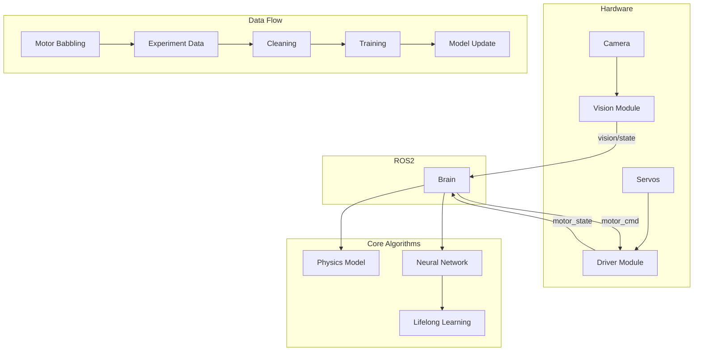
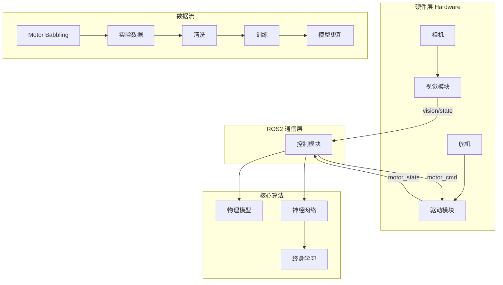

# 🧠 SpatioCoupledNet-HYRD Control System

[English Version](#english-version) | [中文版本](#中文版本)

## English Version

> **SpatioCoupledNet-HYRD: A Spatio-Temporal Coupled Network for Hyper-Redundant Soft Robot Control**
> *Based on ROS2 + PyTorch + OpenCV*
> *Author: 宋玉立 (Song Yuli), NUS student and SMART visiting student*

## Overview

SpatioCoupledNet-HYRD is a spatio-temporal coupled neural network control system for hyper-redundant soft robots. It combines vision-based state estimation, hardware motor control, and learning-based control to support real-time closed-loop operation with emphasis on precise shape control.

**Related Publication**: This repository implements the methods described in the paper "Shape Control of a Planar Hyper-Redundant Robot via Hybrid Kinematics-Informed and Learning-based Approach" by Yuli Song et al. ([arXiv:2603.10402](https://arxiv.org/abs/2603.10402)).

### Key Features
- **Spatio-Temporal Coupling**: SpatioCoupledNet architecture for deep coupling between spatial and temporal domains, enabling precise robot shape control.
- **Precision Control**: Focused on shape control of hyper-redundant robots, combining kinematic priors with learning-based methods.
- Modular design separating vision, control, and driver layers.
- Safety-first behavior with checks to prevent actuator runaway.
- Real-time control at 100Hz, supporting both simulation and real hardware.

> **Note**: This project is large and contains legacy code. Early stages used a lifelong motor-babbling pipeline, while later work migrated to a batch cleaning, data generation, and training workflow. Refer to `robot_brain/big_cleaner.py`, `robot_brain/data_generator_expert_v3.py`, and `robot_brain/train_topo_impulse_big.py` for the current data pipeline.

## System Architecture



## Project Structure

```
src/
├── robot_control/          # Vision and low-level control
│   ├── robot_control/
│   │   ├── vision_node.py      # Main vision node
│   │   ├── xbox_teleop.py      # Xbox controller teleop
│   │   ├── config.py           # Parameter configuration
│   │   ├── algorithms/         # Vision algorithms
│   │   └── ros_utils.py        # ROS utility functions
│   └── launch/                 # Launch files
├── robot_brain/            # Upper-level control and learning
│   ├── robot_brain/
│   │   ├── brain_core.py       # Physics model and NN architecture
│   │   ├── topo_controller.py  # NN controller
│   │   ├── hybrid_phantom_sim.py # Main controller / sim interface
│   │   ├── core/               # Core utilities (planning, cleaning)
│   │   └── scripts/            # Training and maintenance scripts
│   └── launch/                 # Launch files
├── robot_driver/            # Low-level hardware driver
│   ├── src/
│   │   └── driver_node.cpp     # C++ driver node
│   └── CMakeLists.txt
├── robot_interfaces/        # ROS interface definitions
│   ├── msg/
│   └── CMakeLists.txt
└── experiment_data/         # Experimental data (optional upload)
```

## Core Modules

### 1. robot_control (Vision and Low-Level Control)

**Function**: Provides state estimation and basic sensor input. This module is the robot's eyes.

**Components**:
- `vision_node.py`: Main vision node using OpenCV.
- `xbox_teleop.py`: Xbox controller interface.
- `algorithms/`: Vision algorithms such as `tracker_2d.py`, `pose_3d.py`, and `math_utils.py`.
- `config.py`: Calibration and threshold parameters.

**Topics**:
- Publishes `/vision/state` (VisionState), `/vision/image_debug`, `/vision/roi_image`, and `/vision/homography`.
- No subscribers; it runs independently.

**Usage**:
```bash
ros2 run robot_control vision_node --ros-args -p show_local_window:=true
ros2 run robot_control xbox_teleop
```

**Tuning**:
- Replace `jerry_cam_params_1080p_2.npz` with a new OpenCV calibration file if needed.
- The system requires a visible pose board or fiducial marker in view; `robot_control/algorithms/pose_3d.py` and `GlobalPlaneEstimator` rely on this board.
- Update HSV thresholds in `config.py` for joint and target detection.
- Resolution is set to `1920x1080`.

### 2. robot_brain (Upper-Level Control and Learning)

**Function**: Implements intelligent closed-loop control and learning. Combines physics and neural networks to drive the robot.

**Components**:
- `hybrid_phantom_sim.py`: Main controller and simulation interface. Supports physical, neural, and hybrid modes with a matplotlib GUI.
- `dynamic_target.py`: Dynamic target generator for obstacle-aware motion planning.
- `brain_core.py`: Physics engine and the TopoImpulseNet architecture.
- `topo_controller.py`: Legacy NN controller without GUI.
- `core/`: Utilities for planning and data cleaning.
- `scripts/`: Training scripts including `train_topo_impulse_big.py`.

**Topics**:
- Publishes `/motor_cmd` (MotorCommand).
- Subscribes to `/vision/state`, `/motor_state`, `/dynamic_target_cmd`, and `/robot/target_pose_15d`.

**Usage**:
```bash
ros2 run robot_brain hybrid_sim
ros2 run robot_brain dynamic_target
python3 robot_brain/train_topo_impulse_big.py --data_path /path/to/data
```

**Controller Interaction**:
- `1-5`: Switch target joint.
- Arrow keys / W/A/S/D: Move the target.
- `N`: Toggle control mode.
- `R`: Toggle real hardware / simulation mode.
- `Space`: Start/stop logging.

**Tuning**:
- Switch modes in `hybrid_phantom_sim.py` with `N` (0=physics, 1=hybrid, 2=NN).
- Dynamic target parameters use `rep_points` and obstacle avoidance logic.
- Update `MODEL_PATH` to use a different model.
- Learning parameters live in `core/config.py`.

### 3. robot_driver (Hardware Driver)

**Function**: Hardware interface for the robot actuators.

**Components**:
- `driver_node.cpp`: ROS2 C++ driver node.
- `CMakeLists.txt`: Build configuration.

**Topics**:
- Publishes `/motor_state` (MotorState).
- Subscribes to `/motor_cmd`.

**Usage**:
```bash
ros2 run robot_driver driver_node --ros-args -p serial_port:=/dev/sts_servo
```

**Tuning**:
- Serial port is set by `serial_port`.
- Speed and position limits are hard-coded in `driver_node.cpp`.

## Usage Guide

### Install and Build
1. Ubuntu 20.04+, ROS2 Humble, Python 3.10+, PyTorch 2.0+.
2. `git clone <repo> && cd hyrd_robot`
3. `colcon build --merge-install && source install/setup.bash`
4. `pip install torch numpy opencv-python scipy`

### Model Files
The repository includes lightweight model files in the `models/` directory:
- `models/best_model.pth`: Trained neural network weights.
- `models/scalers_only.pt`: Normalization parameters for inference.

These files are required for running the neural network controller. If missing, download from the repository releases or contact the author.

### Startup Order
1. Start vision:
```bash
ros2 run robot_control vision_node
```
Wait for `Plane Locked: True`.
2. Start the driver:
```bash
ros2 run robot_driver driver_node
```
Wait for actuators to power up and complete homing/initialization.
3. Start control:
```bash
ros2 run robot_brain hybrid_sim
```

> The driver must complete homing or zero-point initialization before upper-level control begins.

### Testing and Debugging
- Prefer simulation first with `hybrid_sim`.
- Use `R` to switch between simulation and real hardware.
- Use `N` to toggle control mode.
- Use `Space` to start/stop recordings.
- Monitor `/vision/state` with `ros2 topic echo /vision/state`.
- Use `rviz2` to inspect vision topics if needed.

## Data Processing and Model Training

### Data Cleaning
Use `robot_brain/big_cleaner.py` to clean experimental batches:
- Detect valid segments and filter gaps.
- Unwrap joint angles, interpolate time series, and smooth with Savitzky-Golay.
- Preserve original joint angles for Jacobian calculations.

```bash
python3 robot_brain/big_cleaner.py --root /path/to/lifelong_data
```

### Data Generation
Use `robot_brain/data_generator_expert_v3.py` to create training datasets:
- Strided prediction sampling.
- Savitzky-Golay smoothing.
- Angle handling and feature engineering.

```bash
python3 robot_brain/data_generator_expert_v3.py \
  --root /path/to/lifelong_data \
  --out /path/to/mega_expert_smooth_strided.pt \
  --window 31 --poly 3 --stride 5
```

### Model Training
Train the TopoImpulseNet with:

```bash
python3 robot_brain/train_topo_impulse_big.py \
  --data_path /path/to/mega_expert_smooth_strided.pt
```

Outputs:
- `best_model.pth`
- `checkpoint.pth`
- `log.json`

### Example Workflow

```bash
python3 robot_brain/big_cleaner.py --root ~/hyrd_robot/lifelong_data
python3 robot_brain/data_generator_expert_v3.py \
  --root ~/hyrd_robot/lifelong_data \
  --out ~/hyrd_robot/lifelong_data/mega_expert_smooth_strided.pt
python3 robot_brain/train_topo_impulse_big.py \
  --data_path ~/hyrd_robot/lifelong_data/mega_expert_smooth_strided.pt
ros2 run robot_brain hybrid_sim
```

## Notes
- Check hardware connections before startup.
- The codebase contains literature and legacy modules; focus on core functionality.
- This repository is research source code owned by the author; do not copy, distribute, or commercialize without permission.

## Contact
宋玉立 (Song Yuli), NUS student and SMART visiting student  
yuli.song@nus.edu.sg  
This project was developed during a SMART visiting student period and retains 100% author copyright.

---

## 中文版本

[Back to English](#english-version)

## 📖 SpatioCoupledNet-HYRD 控制系统

> **SpatioCoupledNet-HYRD：面向超冗余软体机器人的时空耦合网络控制系统**
> *基于 ROS2 + PyTorch + OpenCV*
> *作者：宋玉立 (Song Yuli)，新加坡国立大学学生及SMART访问学生*

### 🎯 项目概述

SpatioCoupledNet-HYRD 是一个专为超冗余软体机器人设计的时空耦合神经网络控制系统。该系统集成了**视觉感知**、**底层驱动**和**上层控制**三大模块，重点实现精确的形状控制，支持实时闭环操作。

**相关论文**：本仓库实现了论文《Shape Control of a Planar Hyper-Redundant Robot via Hybrid Kinematics-Informed and Learning-based Approach》中描述的方法，由 Yuli Song 等作者撰写 ([arXiv:2603.10402](https://arxiv.org/abs/2603.10402))。

### 🎯 核心特性
- **时空耦合网络**：SpatioCoupledNet架构实现空间-时间域的深度耦合，精确控制机器人形状。
- **精确控制**：专注于超冗余机器人的形状控制，结合运动学先验和学习方法。
- **模块化设计**：视觉、控制、驱动分离，确保鲁棒性与可维护性。
- **安全优先**：多重检查机制，防止电机失控。
- **实时性能**：100Hz 控制频率，支持实机闭环。

> **注意**：本项目规模较大，内部流程和遗留代码较多。
> 早期曾使用“终身学习 Motor Babbling”方式采集数据，后期已迁移为“批量清洗 + 数据生成 + 训练”流程。
> 当前实际运行应优先参考 `robot_brain/big_cleaner.py`、`robot_brain/data_generator_expert_v3.py` 和 `robot_brain/train_topo_impulse_big.py`。

### 🏗️ 系统架构



## 📂 项目结构

```
src/
├── robot_control/          # 视觉与底层控制
│   ├── robot_control/
│   │   ├── vision_node.py      # 主视觉节点
│   │   ├── xbox_teleop.py      # Xbox 遥控
│   │   ├── config.py           # 参数配置
│   │   ├── algorithms/         # 视觉算法
│   │   └── ros_utils.py        # ROS 工具
│   └── launch/                 # 启动文件
├── robot_brain/            # 上层控制与学习
│   ├── robot_brain/
│   │   ├── brain_core.py       # 物理引擎 & NN 架构
│   │   ├── topo_controller.py  # NN 控制器
│   │   ├── hybrid_phantom_sim.py # 模拟环境
│   │   ├── core/               # 核心工具 (规划、清洗等)
│   │   └── scripts/            # 训练 & 维护脚本
│   └── launch/                 # 启动文件
├── robot_driver/            # 底层驱动
│   ├── src/
│   │   └── driver_node.cpp     # C++ 驱动节点
│   └── CMakeLists.txt          # 构建配置
├── robot_interfaces/        # ROS 接口定义
│   ├── msg/                     # 消息类型
│   └── CMakeLists.txt
└── experiment_data/         # 实验数据 (可选上传)
```

## 🔧 核心模块详述

### 1. robot_control (视觉与底层控制)

**功能**：负责机器人姿态感知与基础控制。是整个系统的“眼睛”和“手”。

**组成**：
- `vision_node.py`：主视觉节点，使用 OpenCV 进行图像处理。
- `xbox_teleop.py`：Xbox 手柄遥控，支持实时控制。
- `algorithms/`：子模块 (tracker_2d.py, pose_3d.py, math_utils.py)。
- `config.py`：参数配置 (颜色阈值、相机路径等)。

**通信 (Topics)**：
- **发布**：
  - `/vision/state` (VisionState)：关节姿态 (ids, x_local, y_local, theta)。
  - `/vision/image_debug` (Image)：调试图像。
  - `/vision/roi_image` (Image)：ROI 图像。
  - `/vision/homography` (Float32MultiArray)：单应性矩阵。
- **订阅**：无 (独立模块)。

**调用方式**：
```bash
# 启动视觉
ros2 run robot_control vision_node --ros-args -p show_local_window:=true
# 启动遥控
ros2 run robot_control xbox_teleop
```

**调参方式**：
- **相机标定**：替换 `jerry_cam_params_1080p_2.npz` (使用 OpenCV 标定工具重新生成)。
- **视觉板要求**：系统依赖可见的定位板/标记板，`robot_control/algorithms/pose_3d.py` 和 `GlobalPlaneEstimator` 需要相机视野内的姿态板。若没有稳定的板子，`/vision/state` 识别会失败。
- **颜色阈值** (`config.py`)：
  - 黄色关节：`YELLOW_LOWER/UPPER` (HSV 值，根据光线调整)。
  - 红色目标：`RED_LOWER_1/2` (两段阈值)。
  - 面积阈值：`RED_MIN_AREA = 800` (过滤噪声)。
- **分辨率**：`WIDTH/HEIGHT = 1920/1080` (相机支持范围内)。

### 2. robot_brain (上层控制与学习)

**功能**：实现智能控制与终身学习。融合物理模型与神经网络，支持实机闭环和仿真可视化。是系统的“大脑”核心。
**组成**：
- `hybrid_phantom_sim.py`：**主控制器**，支持实机闭环和仿真模式（有matplotlib GUI）。融合NN与物理，Beta门控控制，支持三种模式（物理/NN/混合）。可连接实机或纯仿真。
- `dynamic_target.py`：动态目标生成器，读取视觉数据进行避障规划。用于动态demo，实时调整目标姿态避开障碍物。
- `brain_core.py`：物理引擎 (正向运动学、雅可比) + NN 架构 (TopoImpulseNet)。
- `topo_controller.py`：早期NN控制器（实机专用，无界面）。
- `core/`：工具模块 (loom_planner.py 轨迹规划, data_cleaner.py ETL)。
- `scripts/`：训练脚本 (train_topo_impulse_big.py)。

**通信 (Topics)**：
- **发布**：`/motor_cmd` (MotorCommand)：电机命令。
- **订阅**：
  - `/vision/state` (VisionState)：视觉反馈。
  - `/motor_state` (MotorState)：电机状态。
  - `/dynamic_target_cmd` (Float32MultiArray)：动态避障目标（`hybrid_sim` 专用）。
  - `/robot/target_pose_15d` (Float32MultiArray)：目标姿态（`topo_controller` / `target_generator` 相关）。

**调用方式**：
```bash
# 主控制器（实机 + 仿真界面）
ros2 run robot_brain hybrid_sim
# 动态目标生成（避障demo）
ros2 run robot_brain dynamic_target
# 离线训练
python3 robot_brain/train_topo_impulse_big.py --data_path /path/to/data
```

**控制与交互**（hybrid_phantom_sim.py）：
- **键盘控制**：
  - `1-5`：切换目标关节。
  - `↑↓←→/W/A/S/D`：移动目标。
  - `N`：切换控制模式（物理/混合/NN）。
  - `R`：切换实机/仿真模式。
  - `Space`：开始/停止记录。
- **实时可视化**：matplotlib界面显示机器人形状、目标、Beta置信度等。

**调参方式**：
- **控制模式** (`hybrid_phantom_sim.py`)：按`N`键切换（0=物理, 1=混合, 2=NN）。
- **Beta融合**：实时显示在界面上（置信度权重，自动计算）。
- **动态避障** (`dynamic_target.py`)：调整`rep_points` (代表点) 和避障逻辑。
- **模型路径**：`MODEL_PATH` (更换训练模型)。
- **学习参数** (`core/config.py`)：`LR = 1e-4, PATIENCE = 50` (学习率、早停)。

> **历史说明**：本项目最初通过“终身学习 Motor Babbling”采集数据，后期逐步迁移为“批量清洗 + 数据生成 + 训练”流程。当前实际运行应优先参考 `robot_brain/big_cleaner.py`、`robot_brain/data_generator_expert_v3.py` 和 `robot_brain/train_topo_impulse_big.py`。

### 3. robot_driver (底层驱动)

**功能**：硬件接口，控制 10 个舵机 (6 STS + 4 HLS)。

**组成**：
- `driver_node.cpp`：C++ ROS 节点，使用 SMS_STS 库。
- `CMakeLists.txt`：构建配置。

**通信 (Topics)**：
- **发布**：`/motor_state` (MotorState)：位置/负载反馈。
- **订阅**：`/motor_cmd` (MotorCommand)：RPM/位置命令。

**调用方式**：
```bash
ros2 run robot_driver driver_node --ros-args -p serial_port:=/dev/sts_servo
```

**调参方式**：
- **串口**：`serial_port` 参数。
- **限制** (硬编码)：RPM 限 100, 位置限 10-160mm。
- 修改需编辑 `driver_node.cpp` 并重编译。

## 🚀 使用指南

### 安装与构建
1. **环境**：Ubuntu 20.04+, ROS2 Humble, Python 3.10+, PyTorch 2.0+。
2. **克隆**：`git clone <repo> && cd hyrd_robot`。
3. **构建**：`colcon build --merge-install && source install/setup.bash`。
4. **依赖**：`pip install torch numpy opencv-python scipy`。

### 模型文件
仓库在 `models/` 目录下包含轻量级模型文件：
- `models/best_model.pth`：训练好的神经网络权重。
- `models/scalers_only.pt`：推理用的归一化参数。

这些文件是运行神经网络控制器所必需的。若缺失，请从仓库发布页下载或联系作者。

### 启动顺序 (安全第一)
1. **视觉**：`ros2 run robot_control vision_node` (等待 "Plane Locked: True")。
2. **驱动**：`ros2 run robot_driver driver_node` (等待舵机上电并完成 homing/初始化)。
3. **控制**：`ros2 run robot_brain topo_controller` 或 `hybrid_sim`。

> **注意**：驱动节点必须先完成 homing 或初始零点设定，才可进入上层控制。否则电机命令可能出现错误。

### 测试与调试
- **模拟优先**：先用 `hybrid_sim` 测试，避免硬件损坏。
  - 启动后按`R`切换为纯仿真模式。
  - 按`N`切换控制模式（建议先用物理模式，再试混合/NN）。
  - 按`Space`开始/停止记录。
- **实机测试**：确保视觉/驱动已启动，再按`R`切换回实机。
- **RViz**：`ros2 run rviz2 rviz2` 查看 `/vision/image_debug`。
- **日志**：`ros2 topic echo /vision/state` 检查数据。
- **监控Beta**：`hybrid_sim`界面显示实时Beta值（0=纯NN, 1=纯物理，0-1=混合）。

## ⚙️ 调参与扩展

### 常见调参
- **视觉**：光线变化 → 调整 HSV 阈值 (config.py)。
- **控制**：不稳定 → 调低 `W_ANG` 或启用 `PHYSICS_ONLY`。
- **学习**：过拟合 → 增加 `dropout` 或减少 `LR`。

### 扩展指南
- **加新视觉**：继承 `VisionPublisher`，添加新 topic。
- **新控制器**：参考 `topo_controller.py`，实现 `compute_control`。
- **数据处理**：用 `core/data_cleaner.py` 处理新实验。

## 📊 数据处理与模型训练流程

### 数据清洗 (Data Cleaning)
使用 `robot_brain/big_cleaner.py` 进行两阶段清洗：

**第一阶段：孤岛识别**
- 从原始数据中识别连续有效片段。
- 过滤断裂点（时间间隔过大、位置跳变 > 60mm、角度跳变 > 10°）。
- 处理圆周角度（解缠绕 → 插值 → 重缠绕）。

**第二阶段：插值与平滑**
- 使用CubicSpline进行时间插值（对齐延迟补偿）。
- Savitzky-Golay滤波平滑电机和视觉数据。
- 保持原始关节角用于雅可比计算（瞬时性）。

**执行**：
```bash
python3 robot_brain/big_cleaner.py --root /path/to/lifelong_data
```
输出：每个batch文件夹内 `clean_data.npy`（清洗后数据）和 `segments.npy`（有效片段标记）。

### 数据生成 (Data Generation)
使用 `robot_brain/data_generator_expert_v3.py` 从清洗数据生成训练数据集：

**特性**：
- **Strided预测**：跨步采样（默认stride=5，即50ms预测）。
- **SavGol平滑**：对位姿进行窗口平滑（window=31, poly=3）。
- **角度处理**：自动进行角度度弧度转换、解缠绕。
- **特征工程**：生成输入（关节、速度、位姿、雅可比）和标签（位移、全局位置）。

**执行**：
```bash
python3 robot_brain/data_generator_expert_v3.py \
  --root /path/to/lifelong_data \
  --out /path/to/mega_expert_smooth_strided.pt \
  --window 31 --poly 3 --stride 5
```
输出：PyTorch `.pt` 文件，包含 `inputs_state`, `inputs_action`, `inputs_action_phys`, `j_phys`, `targets` 等张量。

### 模型训练 (Model Training)
使用 `robot_brain/train_topo_impulse_big.py` 训练 TopoImpulseNet：

**架构**：
- **GRU层**：捕获时序信息（50步序列）。
- **专家头**：每个关节独立的MLP预测器。
- **Beta门控**：融合物理雅可比（J*dq）和NN预测（置信度权重）。

**训练参数**（可在Config类中调整）：
- `LR = 5e-5`：学习率。
- `BATCH_SIZE = 512`：批大小。
- `EPOCHS = 3000`：最大轮数。
- `PATIENCE = 50`：早停耐心值。

**执行**：
```bash
python3 robot_brain/train_topo_impulse_big.py \
  --data_path /path/to/mega_expert_smooth_strided.pt \
  --resume latest  # 可选：从上次中断恢复
```

**输出**：
- 模型保存在 `lifelong_data/experiments/{exp_id}/`。
- `best_model.pth`：最佳模型。
- `checkpoint.pth`：最新检查点。
- `log.json`：训练曲线（损失、R²、学习率等）。

### 完整流程示例
```bash
# 1. 清洗所有原始数据
python3 robot_brain/big_cleaner.py --root ~/hyrd_robot/lifelong_data

# 2. 生成训练数据
python3 robot_brain/data_generator_expert_v3.py \
  --root ~/hyrd_robot/lifelong_data \
  --out ~/hyrd_robot/lifelong_data/mega_expert_smooth_strided.pt

# 3. 训练模型
python3 robot_brain/train_topo_impulse_big.py \
  --data_path ~/hyrd_robot/lifelong_data/mega_expert_smooth_strided.pt

# 4. 使用模型进行控制
ros2 run robot_brain hybrid_sim
```

### 数据与模型存储
- **实验数据** (`experiment_data/`)：NPZ 文件，存储实验记录（可选上传）。
- **中间数据** (`lifelong_data/batch_*/`)：原始、清洗和生成的数据。
- **训练模型** (`lifelong_data/experiments/`)：模型权重、日志、配置。
- **归一化参数** (`lifelong_data/mega_expert_smooth_strided.pt`)：数据集的scaler（训练和推理都需要）。

## ⚠️ 注意事项

- **安全**：启动前检查硬件连接。NN 模式下监控电机。
- **复现性**：半成品代码可能需调整。优先上传核心模块。
- **贡献**：修改前备份。测试在模拟环境。
- **注意**：本仓库为研究项目源码，归属作者所有。未经授权不得复制、分发或商用。

## 📞 联系

宋玉立 (Song Yuli)，NUS 学生，SMART 访问学生  
yuli.song@nus.edu.sg  
本项目为作者在 SMART 访问学生期间开发，保留 100% 版权与使用权。