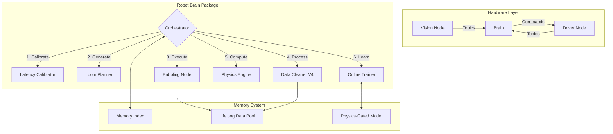

# 🧠 robot_brain: Physics-Informed Lifelong Learning Framework

> **A Self-Evolving Control System for Hyper-Redundant Soft Robots (HYRD)**
> *Author: Brandon (Song Yuli) @ NUS*

**`robot_brain`** 是 HYRD 软体机器人的“大脑”核心。不同于传统的静态训练流程，这是一个**终身学习**（`Lifelong Learning`）系统。它能够通过自主的物理交互（Motor Babbling），不断积累经验，动态修正物理模型与神经网络的偏差，实现从“无知”到“精通”的自我进化。

该系统集成了 **自动标定**、**安全规划**、**闭环控制**、**ETL清洗**、**物理特征工程** 以及 **在线增量训练** 六大模块，形成了一个完全自动化的闭环流水线。

---

## 🏗️ 宏观架构 (System Architecture)

整个系统由 **`Orchestrator` (总指挥)** 驱动，采用**模块化设计**。数据流与控制流严格分离，确保了系统的鲁棒性与可维护性。



---

## 🔄 核心工作流 (The Infinite Loop)

系统启动后进入无限循环 (`Loop 000` -> `Loop N`)，每一轮循环包含以下六个严格的时序阶段：

### 1. 动态时延标定 (Auto-Calibration)

* **模块**: `core/latency_calib.py`
* **痛点**: 软体机器人的控制精度极度依赖视觉反馈与电机指令的时间对齐。CPU 负载波动会导致 10-100ms 的时延抖动。
* **实现**: 机器人执行 A-B-A 高速阶跃运动。系统利用统计学边缘检测（Robust Edge Detection）捕捉电机指令与视觉响应的相位差。
* **算法**: 使用 `Trimmed Mean` (掐头去尾平均法) 剔除离群值，计算出当前 Batch 专属的毫秒级物理时延。

### 2. 安全约束规划 (Constrained Planning)

* **模块**: `core/loom_planner.py`
* **实现**: 基于 **Sobol 低差异序列** 生成高维关节空间的目标点。
* **亮点**:
* **可行域投影**: 将随机生成的点强制投影到物理可行域内（解决耦合约束）。
* **加权贪婪排序**: "Base重，Tip轻"。为了保护电机，算法优先移动末端轻负载关节，最小化基座重负载关节的行程。


### 3. 物理采样执行 (Execution)

* **模块**: `core/babbling_node.py`
* **功能**: 通过 ROS 2 话题控制机器人跟踪生成的轨迹。
* **工程细节**:
* **全系统就绪锁**: 启动前强制检查 `Trajectory`, `Motor`, `Vision` 三大信号。
* **安全看门狗**: 0.2s 内无心跳自动触发急停（E-Stop）。
* **实时反馈**: 终端实时显示进度条与剩余时间预估 (ETA)。


### 4. 数据清洗与对齐 (ETL - V4)

* **模块**: `core/data_cleaner.py`
* **核心挑战**: 处理传感器丢包、频率不通过及信号噪声。
* **V4 算法**:
* **切片逻辑**: 不丢弃含有空洞的数据，而是根据空洞将长数据切碎为多个 `Valid Blocks`。
* **动态对齐**: 读取第一步生成的 `latency.json`，使用 **三次样条插值 (Cubic Spline)** 将视觉信号在时间轴上精确平移，实现物理对齐。


### 5. 物理特征工程 (Physics Feature Engineering)

* **模块**: `core/feature_eng.py`
* **核心**: 引入先验知识。
* **实现**: 使用 **Numba (`@jit`)** 并行加速计算常曲率（CC）运动学模型的雅可比矩阵 ()。
* **输出**: 生成包含  的 PyTorch Tensor。

### 6. 在线增量训练 (Online Learning)

* **模块**: `core/trainer.py`
* **模型架构**: **Physics-Gated Residual Network (物理门控残差网络)**。
* 
* 网络只学习物理模型解释不了的“残差”，极大地提高了数据效率。


* **终身学习策略**:
* **经验回放 (Experience Replay)**: 维护一个滑动窗口（最近 15 个 Batch）+ 精英样本池（Loss 较大的困难样本）。
* **预推断 (Pre-Inference)**: 训练前先评估新数据。如果 Loss 已低于阈值，直接跳过训练，节省算力。
* **参数热更新**: 动态校准物理分支的 Normalizer，适应环境变化。


---

## 🛠️ 安装与编译 (Installation)

### 1. 依赖安装

确保系统已安装必要的 Python 科学计算库：

```bash
pip install numpy scipy torch numba tqdm colorama matplotlib

```

### 2. 编译 (Build)

**注意**: 本项目必须使用 `--merge-install` 指令进行编译，以确保环境路径正确解析。

```bash
cd ~/brandon/hyrd_robot
colcon build --packages-select robot_brain --merge-install
source install/setup.bash

```

---

## 🚀 启动指南 (Usage)

为了保证物理系统的安全性，请务必遵循以下**三步启动法**：

### 步骤 1: 启动视觉 (Eyes)

```bash
ros2 run robot_control vision_node

```

* **等待条件**: 终端显示 `[INFO] Plane Locked: True`。

### 步骤 2: 启动驱动 (Hands)

```bash
ros2 run robot_driver driver_node

```

* **操作**: 等待 2 秒，确保舵机上电锁止且无异常噪音。

### 步骤 3: 启动大脑 (Brain)

```bash
ros2 run robot_brain orchestrator

```

* **现象**: 系统将自动开始 Loop 0，依次进行标定、规划、执行、清洗和训练。

---

## 📂 数据与记忆管理

所有生成的数据均保存在 `~/brandon/hyrd_robot/lifelong_data/` 目录下。

### 目录结构

```text
lifelong_data/
├── memory_index.json       # 记忆索引 (记录历史 Batch 和精英样本)
├── models/                 # 模型权重 (.pth)
├── batch_000/              # 第 0 轮数据
│   ├── latency.json        # 物理时延配置
│   ├── targets.npy         # 规划轨迹
│   ├── raw_data.npy        # 原始采样
│   ├── clean_data.npy      # 清洗后数据
│   └── train_data.pt       # 训练用张量
└── batch_001/ ...

```

### 记忆维护工具 (`memory_tool.py`)

如果遇到坏数据（如撞击、遮挡）或需要迁移环境，请使用脚本进行维护，不要直接删除文件夹。

```bash
# 1. 删除特定的坏 Batch (同时更新索引)
python3 src/robot_brain/scripts/memory_tool.py --del_batch batch_012

# 2. 切换环境 (清空短期记忆，保留模型和精英样本)
python3 src/robot_brain/scripts/memory_tool.py --new_place

# 3. 查看当前记忆状态
python3 src/robot_brain/scripts/memory_tool.py --status

```

---

## ⚙️ 全局配置

所有可调参数（学习率、采样点数、早停阈值等）均集中管理于：
`src/robot_brain/robot_brain/core/config.py`

关键参数：

* `MEMORY_WINDOW_SIZE`: 滑动窗口大小 (默认 15)。
* `MAX_EPOCHS_FINE_TUNE`: 在线微调轮数 (默认 50)。
* `PRE_INF_LOSS_THRESHOLD`: 预推断跳过阈值 (默认 0.02)。

---

## 🌟 工程亮点 (Why this works)

1. **逻辑零漂移 (Zero-Drift)**: 所有的核心数学逻辑（插值、滤波、雅可比计算）都经过了严格的代码比对，确保与验证过的实验脚本完全一致。
2. **自我修复 (Self-Healing)**: `Orchestrator` 具备原子化检查机制。如果在某一步骤中断（如断电），重启后会自动检测断点，从中断处继续，绝不重复采集，也不丢失数据。
3. **鲁棒性 (Robustness)**:
* 硬件层：多重状态锁保护。
* 数据层：V4 碎片化清洗算法，从容应对通信丢包。
* 模型层：动态 Scaler 更新机制，防止“灾难性遗忘”和分布漂移。


---

*This project is part of the Master's Thesis research on Soft Robot Control.*